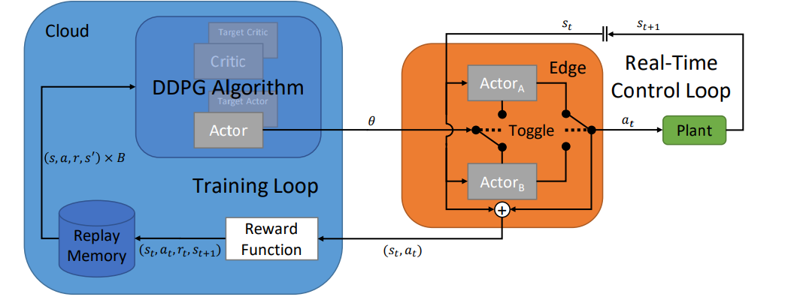

<!-- PROJECT LOGO -->
<br />
<p align="center">

  <h1 align="center">Cloud-Edge Training Architecture for  <br>Sim-to-Real Deep Reinforcement Learning </h1>


  <p align="center">
    IROS, 2022
    <br />
    <a href="https://rtsl.cps.mw.tum.de/view_member?id=15"><strong>Hongpeng Cao</strong></a>
    ·
    <a href="https://theilem.gitlab.io/"><strong>Mirco Theile</strong></a>
    ·
    <a href=""><strong>Federico G. Wyrwal</strong></a>
    ·
    <a href="https://rtsl.cps.mw.tum.de/personal_page/mcaccamo/"><strong>Marco Caccamo</strong></a>
    ·
  </p>

  <p align="center">
    <a href='https://arxiv.org/pdf/2203.02230.pdf'>
      
    </a>
    <a href='' style='padding-left: 0.5rem;'>
      </a>
    <a href='https://www.youtube.com/watch?v=hMY9-c0SST0&t=1s&ab_channel=HongpengCao' style='padding-left: 0.5rem;'>
      </a>
    </a>
</p>
<br />

This repository contains a Tensorflow implementation for the paper: [Cloud-Edge Training Architecture for
Sim-to-Real Deep Reinforcement Learning](https://arxiv.org/pdf/2203.02230.pdf). In this work, we propose a distributed cloud-edge architecture to train DRL agents in the real world in real-time. In the architecture, the inference and training are assigned to the edge and cloud, separating the real-time control loop from the computationally expensive training loop. 

## Overview



### Preparation
Clone this repository: 
```Shell
git clone 
cd rips
```

Install requirements in a virtual environment (Tested on anaconda/miniconda environment):

```Shell
conda create --name cloudedge python==3.8.0 
```

```Shell
pip install -r requirements.txt
```

The code is tested on Python `3.8.0`, Tensorflow `2.9.0`  

### Generate a configuration template

```Shell
python main_ddpg.py --generate
```
A configuration template of .json will be generated and saved under ./config. One can change the parameter to try different configurations. 

### Train a model in simulation

```Shell
python main_ddpg.py --config {DIR-CONFIGURATION} --id {NAME} --weights {DIR-PRETRAINED MODEL}
```

### Training in real world

#### On the edge device
```Shell
ssh username@ip_edge_device
cd rips
```
Training
```Shell 
python main_edgecontrol.py --config ./config/remote/remote_edgecontrol.json
```
Evaluating

```Shell 
python main_edgecontrol.py --eval {DIR-PRETRAINED MODEL}
```

#### On the cloud device

Launch training process

```Shell
python main_cloudtrain.py --config ./config/remote/remote_cloud_ddpg.json --id remote_training
```

Real-time streaming 
```Shell
python main_scope.py --config config/remote/remote_plant_scope.json
```

### Citation

If you find our work useful in your research, please cite:

```BiBTeX
@INPROCEEDINGS{9981565,
  author={Cao, Hongpeng and Theile, Mirco and Wyrwal, Federico G. and Caccamo, Marco},
  booktitle={2022 IEEE/RSJ International Conference on Intelligent Robots and Systems (IROS)}, 
  title={Cloud-Edge Training Architecture for Sim-to-Real Deep Reinforcement Learning}, 
  year={2022},
  pages={9363-9370},
  doi={10.1109/IROS47612.2022.9981565}}
```

## Acknowledgements
This project was supported by an Alexander von Humboldt Professorship endowed by the German Federal
Ministry of Education and Research. The authors would like to thank Daniele Bernardini, Andrea Bastoni, Alexander Zupke and Andres Rodrigo Zapata Rodriguez for helpful discussions.
